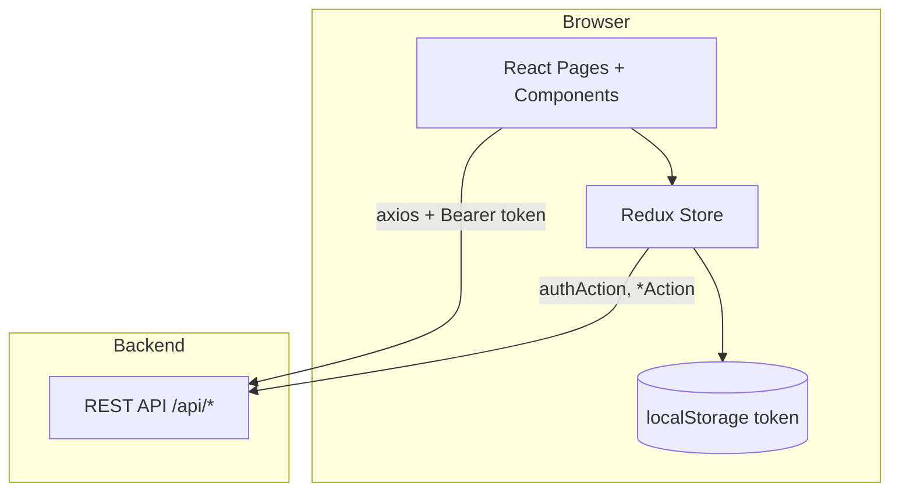

# Arsitektur Admin Presensi

Dokumen ini menjelaskan bagaimana frontend diorganisasi, alur autentikasi, dan pemetaan modul ke API backend.

## Diagram alur tingkat tinggi



## Lapisan aplikasi

### 1. Entry (`main.jsx`)

- Mount React 18 dengan `createRoot`
- `Provider` Redux membungkus `App`
- Strict Mode aktif

### 2. Routing (`App.jsx`)

- `BrowserRouter` + `Routes` / `Route`
- Pola umum halaman terproteksi:

```jsx
<Route
  path="/contoh"
  element={
    <Protected>
      <MainLayout>
        <Halaman />
      </MainLayout>
    </Protected>
  }
/>
```

- `Protected` (`loginOnly` untuk `/login`): cek `state.auth.token`, redirect jika perlu
- `MainLayout`: sidebar + area konten

### 3. Navigasi (`Sidebar.jsx`)

- Memuat profil via `dispatch(getMe())` saat mount
- Menu dinamis berdasarkan `user.role`:
  - `monitoring` → menu terpisah (Monitoring Presensi)
  - `super_admin` → tambah Manajemen Admin, Setting Izin; tanpa Daftar Libur
  - lainnya → menu admin unit lengkap (kecuali fitur super admin)

### 4. State Redux

| Slice | File reducer | Action utama | Domain |
|-------|--------------|--------------|--------|
| `auth` | `authReducer.js` | `authAction.js` | Login, token, user |
| `dashboard` | `dashboardReducer.js` | `dashboardAction.js` | Statistik dashboard |
| `shift` | `shiftReducer.js` | `shiftAction.js` | Shift & shift detail |
| `presensi` | `presensiReducer.js` | `presensiAction.js` | History, rekap, event, dinas |
| `pegawai` | `pegawaiReducer.js` | `pegawaiAction.js` | Data pegawai |
| `unit` | `unitReducer.js` | `unitAction.js` | Unit organisasi |
| `unitDetail` | `unitDetailReducer.js` | `unitDetailAction.js` | Lokasi presensi per unit |
| `izin` | `izinReducer.js` | `izinAction.js` | Master & pengajuan izin |
| `admin` | `adminReducer.js` | `adminAction.js` | CRUD admin |
| `hariLibur` | `hariLiburReducer.js` | `hariLiburAction.js` | Hari libur |
| `laukPauk` | `laukPaukReducer.js` | `laukPaukAction.js` | Rekap lauk pauk |
| `tambahPegawai` | `tambahPegawaiReducer.js` | — | State form tambah pegawai |

Monitoring admin unit menggunakan `adminMonitoringAction.js` (fetch unit yang di-assign).

### 5. Autentikasi

1. **Login** — `POST /api/admin/login` → `token` → `setToken` + `localStorage`
2. **Profil** — `GET /api/admin/me` dengan header Bearer
3. **Logout** — hapus token & user, navigasi ke `/login` (konfirmasi SweetAlert2)

Tidak ada refresh token di frontend; sesi bergantung pada token yang disimpan hingga logout atau token kedaluwarsa di backend.

### 6. Pemanggilan API

- Base: `import.meta.env.VITE_API_URL`
- Pola umum di actions:

```javascript
const response = await axios.get(
  `${import.meta.env.VITE_API_URL}/api/...`,
  { headers: { Authorization: `Bearer ${token}` } }
);
```

- Beberapa halaman (mis. `DataIzin.jsx`, `Dinas.jsx`) memanggil API langsung di komponen
- Upload file / FormData digunakan di modul lokasi, event, izin (lihat masing-masing halaman)

## Modul halaman (`src/pages`)

### `data_pegawai/`

| File | Fungsi |
|------|--------|
| `Pegawai.jsx` | Daftar & kelola pegawai per unit |
| `ManajemenAdmin.jsx` | CRUD admin (super admin) |
| `TambahPegawaiKeUnitDetail.jsx` | Assign pegawai ke unit detail |

### `presensi/` (inti bisnis)

| File | Fungsi |
|------|--------|
| `AturLokasi.jsx` | Peta & polygon/radius lokasi presensi |
| `AturShift.jsx`, `ShiftDetail.jsx`, `TambahKaryawanKeShift.jsx` | Manajemen shift |
| `ShiftDosenKaryawan.jsx` | Penempatan pegawai pada shift |
| `Event.jsx`, `EventTambah.jsx`, `EventEdit.jsx`, `EventDetail.jsx`, `EventPegawai.jsx` | Siklus event |
| `DaftarLibur.jsx` | Kalender hari libur |
| `DataIzin.jsx` | Master jenis izin & pengajuan |
| `Dinas.jsx`, `TambahDinas.jsx` | Perjalanan dinas |
| `RekapPresensiBulanan.jsx` | Rekap per unit/bulan |
| `DetailRekapBulananPegawai.jsx`, `DetailHistoryPresensi.jsx`, `LaporanKehadiranPegawai.jsx` | Drill-down pegawai |
| `rekapBulananPegawai/*` | Sub-komponen rekap (presensi, lembur, lauk pauk, history) |
| `monitoring/*` | Varian monitoring untuk role `monitoring` |
| `MonitoringPresensi.jsx` | Tab + nested routes monitoring |
| `ImportDataCSV.jsx` | Impor data dari CSV |
| `SettingPresensi.jsx` | Pengaturan presensi pegawai (jika dipakai) |

### Root pages

| File | Fungsi |
|------|--------|
| `Home.jsx` | Dashboard charts & KPI |
| `Login.jsx` | Form login |

## Ringkasan endpoint API

Endpoint di bawah ini dipanggil dari frontend (prefix: `{VITE_API_URL}`). Daftar tidak ekshaustif; cek file action terkait untuk parameter query/body.

### Auth & admin

| Method | Path |
|--------|------|
| POST | `/api/admin/login` |
| GET | `/api/admin/me` |
| GET/POST/PUT/DELETE | `/api/admin`, `/api/admin/create`, `/api/admin/update/:id`, `/api/admin/delete/:id` |
| — | `/api/admin/monitoring` (unit monitoring) |

### Unit & lokasi

| Method | Path |
|--------|------|
| GET/POST/PUT/DELETE | `/api/unit`, `/api/unit/create`, `/api/unit/update/:id`, `/api/unit/delete/:id` |
| GET | `/api/unit/with-location` |
| GET/POST/DELETE | `/api/unit-detail/...` |

### Shift & presensi

| Method | Path |
|--------|------|
| CRUD | `/api/shift`, `/api/shift-detail/...` |
| GET | `/api/presensi/history-by-unit`, `/api/presensi/rekap-by-unit`, `/api/presensi/overtime`, dll. |
| GET | `/api/pengajuan-izin`, `/api/pengajuan-izin/approve/:id` |
| CRUD | `/api/{jenis}` (master izin dinamis) |

### Event, dinas, libur, lauk pauk

| Method | Path |
|--------|------|
| — | `/api/events/*` |
| — | `/api/dinas/*` |
| — | `/api/hari-libur/*` |
| — | `/api/lauk-pauk/*` |

### Dashboard

| Method | Path |
|--------|------|
| GET | `/api/dashboard?bulan=&tahun=&unit_id=` |

File referensi: `src/redux/actions/*.js` dan grep `VITE_API_URL` di `src/`.

## UI & peta

- **Tailwind CSS 4** via plugin `@tailwindcss/vite`
- **Material Icons** (font dari layout/HTML—pastikan link icon dimuat di `index.html`)
- **Peta**: Leaflet (`react-leaflet`, `leaflet-draw`, geocoder) dan OpenLayers (`ol`) di modul lokasi
- **Chart**: Recharts di dashboard
- **PDF**: jsPDF + jspdf-autotable untuk export laporan
- **Notifikasi**: SweetAlert2

## Monitoring — nested routing

`MonitoringPresensi.jsx` memakai:

- Query `?tab=history|rekap|lembur|laukpauk` untuk tab utama
- Sub-routes di bawah `/monitoring_presensi/`:
  - `rekap-bulanan-pegawai/:pegawai_id`
  - `detail-history-presensi/:pegawai_id/:unit_id`
  - `laporan-kehadiran/:pegawai_id`

Tab aktif disimpan di `localStorage` key `monitoringPresensiTab`.

## Build & deploy

1. Set `VITE_API_URL` ke URL production API saat build
2. `npm run build` → output di `dist/`
3. Deploy `dist/` ke static hosting (Nginx, S3, Vercel, dll.)
4. Pastikan backend mengizinkan CORS origin frontend

## Catatan teknis

- Duplikat file backup (`AturLokasi copy.jsx`, `ManajemenAdmin copy.jsx`) tidak dipakai di routing—hindari mengedit untuk fitur baru
- Route Import CSV (`/import_csv`) ada di `App.jsx` tetapi item menu di sidebar dikomentari
- Typo path `/menejemen_admin` disengaja mengikuti kode existing (konsisten dengan sidebar)
